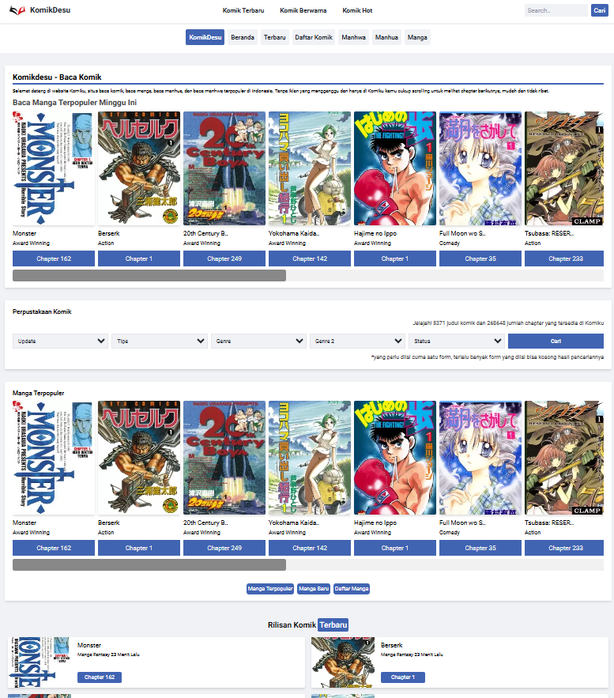
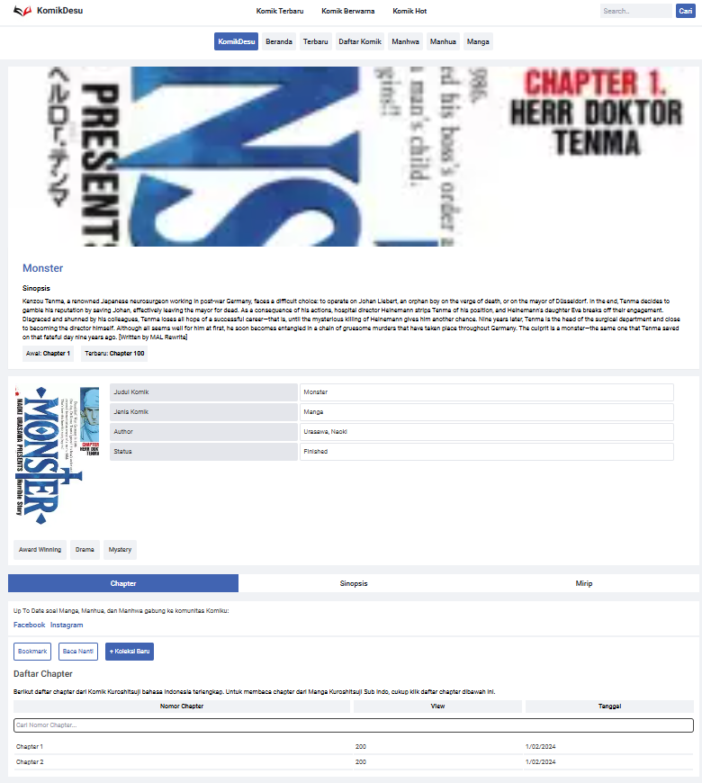

<h1>KomikDesu - Reading Komik Indonesia 💻</h1>

<p align="center">
  
</p>
 
<p align="center">Main Page.</p>

<p align="center">
  
</p>
 
<p align="center">Detail Komik.</p>

<p align="center">
  
</p>
 
<p align="center">Rak Buku ( Library ).</p>

## Installation For Window/RDP

```bash
npm i
npm run build
npm start
```

## Disclaimer
this website have a fiture like 
- History ❌
- Bookmark ✔
- Baca Nanti ( Read Later ) ✔
- Unlimited Scroll Like [Komiku](https://komiku.id/)
- Chapter Page ❌

## Api
```https://api.jikan.moe/v4```

## License

This project is under the [Yanzz](https://github.com/Yanzz231)

## Helper 🤖

Just DM me with instagram [Yanz](https://www.instagram.com/iyanmikasa/)
